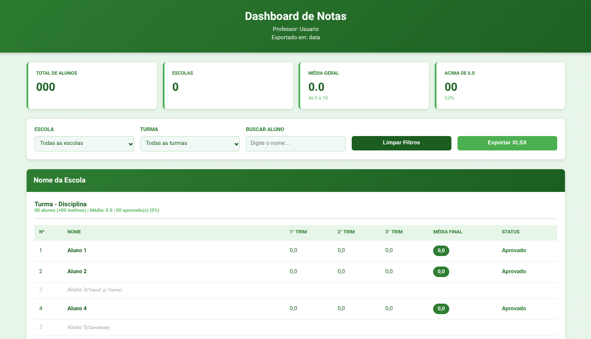

# Dashboard de Notas EscolaRS

Extensão para Google Chrome que permite **visualizar, filtrar, analisar e exportar notas de alunos** do sistema EscolaRS através de um dashboard interativo.

A ferramenta foi criada para **facilitar o trabalho de professores**, permitindo analisar rapidamente o desempenho das turmas e exportar dados organizados em planilhas.

---

# Motivação

O portal do EscolaRS oferece acesso às notas dos alunos, porém **não possui ferramentas adequadas para análise pedagógica ou exportação estruturada dos dados**.

Esta extensão foi desenvolvida para:

- facilitar a visualização das notas
- automatizar cálculos de médias
- permitir filtragem eficiente de dados
- gerar planilhas organizadas para análise ou relatórios
- auxiliar professores na gestão das turmas

---

# Dashboard



*Imagem com dados anonimizados para preservar a privacidade dos alunos.*

---

# Funcionalidades

## Dashboard de Visualização

- Visualização organizada por **turma, disciplina e aluno**
- Interface simples e rápida
- Atualização dinâmica dos dados

---

## Filtros Dinâmicos

Permite filtrar os dados por:

- **Escola**
- **Turma**
- **Nome do aluno**

Os filtros funcionam em tempo real, facilitando a navegação em turmas grandes.

---

## Cálculo Automático de Médias

A extensão calcula automaticamente as médias dos alunos.

### Trimestral

```

Média = (T1 × 3 + T2 × 3 + T3 × 4) ÷ 10

```

---

## Suporte a Recuperação (ER)

Notas de **Estudos de Recuperação (ER)** são consideradas no cálculo final quando disponíveis.

---

## Gestão de Alunos Inativos

Alunos inativos são tratados de forma diferenciada:

- exibidos em **cinza**
- não interferem nos cálculos estatísticos
- não possuem valores numéricos

Isso evita distorções na média da turma.

---

## Estatísticas em Tempo Real

O dashboard apresenta indicadores automáticos como:

- número de alunos ativos
- médias calculadas
- status de aprovação

---

## Exportação para Excel (XLSX)

É possível exportar os dados filtrados para uma planilha Excel.

Características da exportação:

- **uma aba por turma**
- dados organizados por disciplina
- formatação numérica brasileira
- compatível com Excel, LibreOffice e Google Sheets

---

# Estrutura do Projeto

```

escolaRS-extensao/
├── manifest.json        # Configuração da extensão (Manifest V3)
├── background.js        # Service Worker (autenticação e comunicação com API)
├── dashboard.html       # Interface principal do dashboard
├── dashboard.js         # Lógica da aplicação e filtros
├── xlsx.mini.min.js     # Biblioteca para exportação XLSX
└── images/icons/               # Ícones da extensão

```

---

# Instalação

Clone o repositório:

```

git clone [https://github.com/EduardoLBorges/escolaRS-extensao.git](https://github.com/EduardoLBorges/escolaRS-extensao.git)

```

Abra o Chrome e acesse:

```

chrome://extensions

```

Ative o **Modo do Desenvolvedor**.

Clique em **Carregar extensão não empacotada** e selecione a pasta:

```

escolaRS-extensao

```

Depois faça login normalmente no **portal EscolaRS**.

---

# Como Usar

## Aplicar filtros

Use os campos do dashboard para selecionar:

- escola
- turma
- aluno específico

Os dados serão atualizados automaticamente.

---

## Exportar dados

1. Aplique os filtros desejados  
2. Clique em **Exportar XLSX**  
3. O arquivo será gerado automaticamente com uma aba por turma

---

# Status de Alunos

| Status | Critério |
|------|------|
| Aprovado | Média ≥ 6,0 |
| Recuperação | Média entre 5,0 e 5,9 |
| Reprovado | Média < 5,0 |
| Inativo | Não entra nos cálculos |

---

# Tecnologias Utilizadas

- Chrome Extension **Manifest V3**
- **JavaScript (ES6+)**
- **HTML5**
- **CSS3**
- **Service Worker**
- **XLSX.js** para geração de planilhas

---

# Requisitos

- Navegador **Google Chrome**
- Autenticação ativa no sistema **EscolaRS**
- Permissão para carregar extensões locais

---

# Roadmap (Evoluções Futuras)

Possíveis melhorias:

- gráficos de desempenho das turmas
- estatísticas de aprovação
- comparação entre turmas
- exportação em PDF
- dashboard com indicadores pedagógicos
- análise de distribuição de notas

---

# Contribuição

Sugestões e melhorias são bem-vindas.

1. Faça um fork do projeto  
2. Crie uma branch para sua feature

```

git checkout -b minha-feature

```

3. Envie um pull request

---

# Licença

Este projeto está licenciado sob a **MIT License**.

---

# Autor

**Eduardo L. Borges**

GitHub:  
https://github.com/EduardoLBorges
